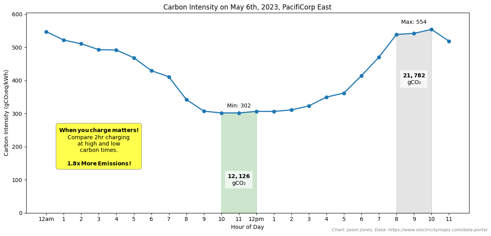

# Grid Carbon Intensity Analysis

This project analyzes hourly carbon intensity data from the U.S. electrical grid across 55 different zones, using data from [Electricity Maps](https://www.electricitymaps.com/data-portal/united-states-of-america). The analysis provides insights into regional variations in carbon intensity, renewable energy adoption, and daily variability patterns.


## Key Findings and Insights

### 1. Regional Carbon Intensity Variations

The map shows significant regional variations in carbon intensity across the United States, with some zones consistently showing higher carbon intensity than others.

### 2. Daily Patterns in PACE Region

Detailed analysis of the PACE (PacifiCorp East) region shows distinct daily patterns in carbon intensity, with notable peaks during high demand periods.

### 3. Monthly Trends

Monthly analysis reveals seasonal patterns in carbon intensity, with variations likely tied to renewable energy availability and seasonal demand changes.

### 4. Impact on EV Charging

Analysis demonstrates how EV charging timing can significantly impact carbon emissions, with optimal charging windows during periods of lower grid carbon intensity.

### 5. Daily Variability Analysis

This visualization shows the average daily variability in carbon intensity, highlighting the importance of timing for energy-intensive activities.

## Setup

1. Clone this repository
2. Install required dependencies:
```bash
pip install pandas requests
```

## Data Collection

The project includes a script to download hourly carbon intensity data for all U.S. grid zones:

```bash
python download_carbon_data.py
```

Note: The current script is configured for 2023 data. When 2024 data becomes available, modify the `base_url` in `download_carbon_data.py` to:
```python
base_url = 'https://data.electricitymaps.com/2024-01-17'  # Update this date pattern as needed
```

## Analysis

Run the analysis script to generate insights about carbon intensity across different zones:

```bash
python analyze_carbon_data.py
```

This will produce:
- Rankings of zones by average carbon intensity
- Detailed statistics for the top 5 highest carbon intensity zones
- Analysis of daily variability patterns
- Renewable energy percentage statistics


## Data Structure

The hourly data files are stored in `data/hourly/` with the following format:
- Each file named as `{ZONE_ID}_2023_hourly.csv`
- Contains columns for datetime, carbon intensity, renewable percentage, and zone information

## Contributing

Feel free to submit issues and enhancement requests! 