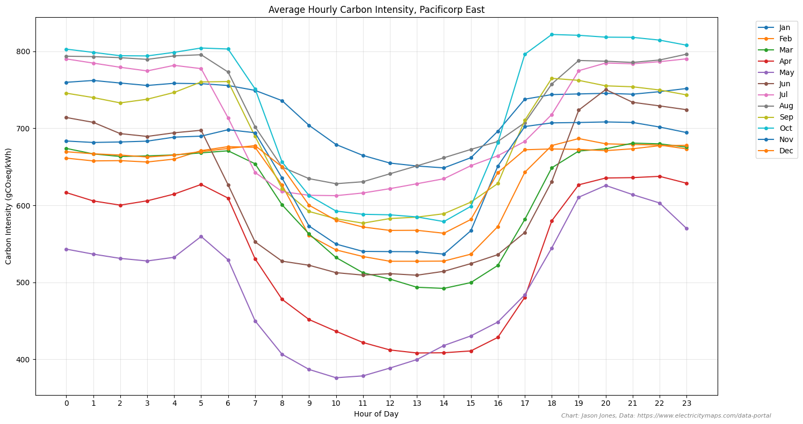

# Grid Carbon Intensity & Load Shifting Analysis

## Summary

The grid is getting cleaner each year with new renewable--but intermittent--energy sources (mostly wind and solar) and the retirement of coal plants. There are 61 interconnected "grids" in the USA that vary dramatically from the cleanest (24 gCO2eq/kWh) to the dirtiest (766 gCO2eq/kWh). Often in the dirtiest grids, the daily carbon intensity can varyBased on WHEN consumers use electricity, users of the same grid, in this case PacifiCorp East, can emit up to 56% less carbon by shifting their usage to periods of lower carbon intensity. *TODO: Add USA carbon intensity chart* My home grid, PacifiCorp East services 1.2 million customers in Utah, Wyoming, and Idaho and is the 4th dirtiest grid in the country.

| Power Source | Installed Capacity (MW) | Carbon Intensity (gCO₂eq/kWh) |
|--------------|-------------------------|-------------------------------|
| Coal         | 6,990                  | 1,097                        |
| Wind         | 3,600                  | 11                           |
| Natural Gas  | 3,450                  | 524                          |
| Solar        | 2,190                  | 27                           |
| Hydroelectric|   272                  | 24                           |
| Other        |    53                  | ~700                         |

This project analyzes hourly carbon intensity data from the U.S. electrical grid across 55 different zones, using data from [Electricity Maps](https://www.electricitymaps.com/data-portal/united-states-of-america) (see also interactive map [here](https://app.electricitymaps.com/map)). The analysis provides insights into regional variations in carbon intensity, renewable energy adoption, and daily variability patterns.


## Key Insights

### 1. Do you know how dirty your local grid is?
From the cleanest grids--powered by hydro--at 24 gCO2eq/kWh to the dirtiest--powered by coal (above 1000 gCO2eq/kWh), the carbon intensity of the US grid can vary by an order of magnitude.  Also interesting to note the amount of daily variability in carbon intensity for each zone.  Run analyze_carbon_data.py for a more complete list.  Ouch!  My grid, Pacificorp East (PACE), is the 4th dirtiest in the country.


Even when the averages are similar, there can be significant differences in the variability in seasonal and even daily intensities.  Those with the highest variability provide load shifting opportunities to reduce carbon emissions by almost 2x  (see below).


### 2. Some months have significantly more variability than others
In the PACE example, the daily variability is highest in May.  By load shifting, PACE customers can reduce their grid carbon intensity by 56% on average and 80%


### 3. Monthly Trends
Each day varies significantly based on the weather.  These charts shows the average hourly intensity by month.  Generally the cleanest hours are midday.


### 4. Daily Patterns in PACE Region
The most variable day in 2023 was 18th June at 149%.


### 5. Impact on EV Charging
Analysis demonstrates how EV charging timing can significantly impact carbon emissions, with optimal charging windows during periods of lower grid carbon intensity.


## Setup

1. Clone this repository
2. Install required dependencies:
```bash
pip install pandas requests
```

## Data Collection

The project includes a script to download hourly carbon intensity data for all U.S. grid zones:

```bash
python download_carbon_data.py
```

Note: The current script is configured for 2023 data. When 2024 data becomes available, modify the `base_url` in `download_carbon_data.py` to:
```python
base_url = 'https://data.electricitymaps.com/2024-01-17'  # Update this date pattern as needed
```

## Analysis

Run the analysis script to generate insights about carbon intensity across different zones:

```bash
python analyze_carbon_data.py
```

This will produce:
- Rankings of zones by average carbon intensity
- Detailed statistics for the top 5 highest carbon intensity zones
- Analysis of daily variability patterns
- Renewable energy percentage statistics


## Data Structure

The hourly data files are stored in `data/hourly/` with the following format:
- Each file named as `{ZONE_ID}_2023_hourly.csv`
- Contains columns for datetime, carbon intensity, renewable percentage, and zone information

## Contributing

Feel free to submit issues and enhancement requests! 